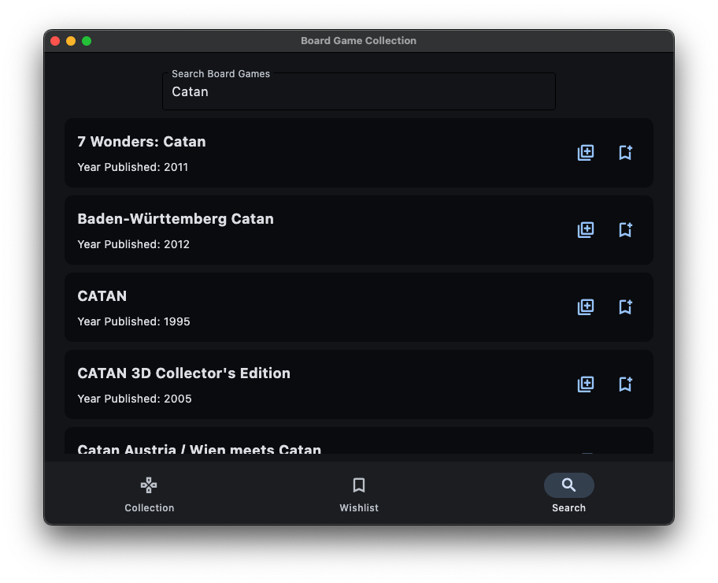
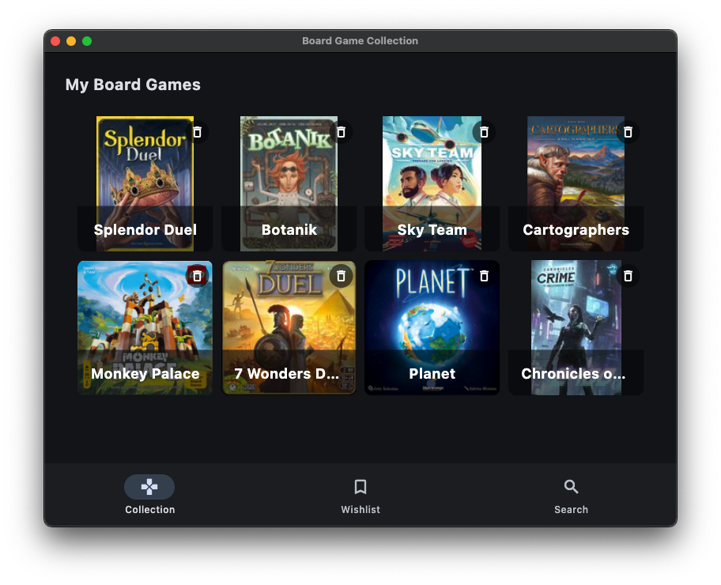
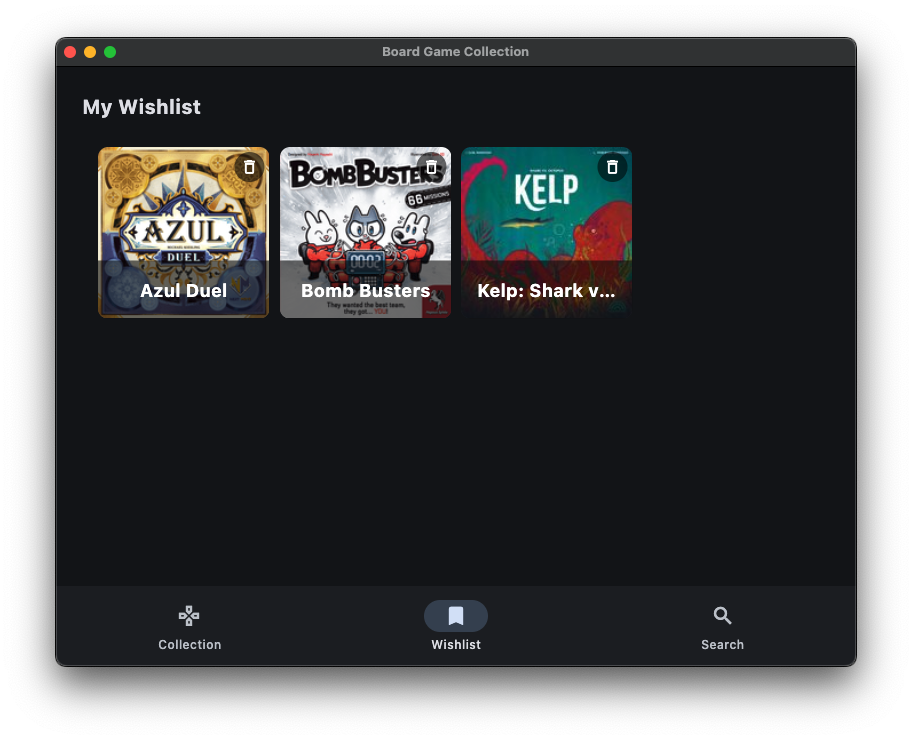
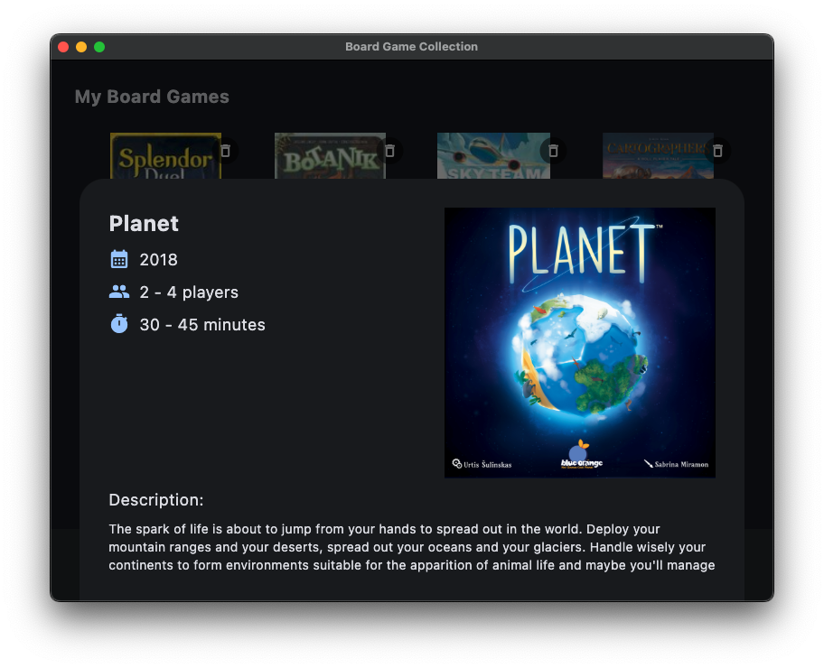
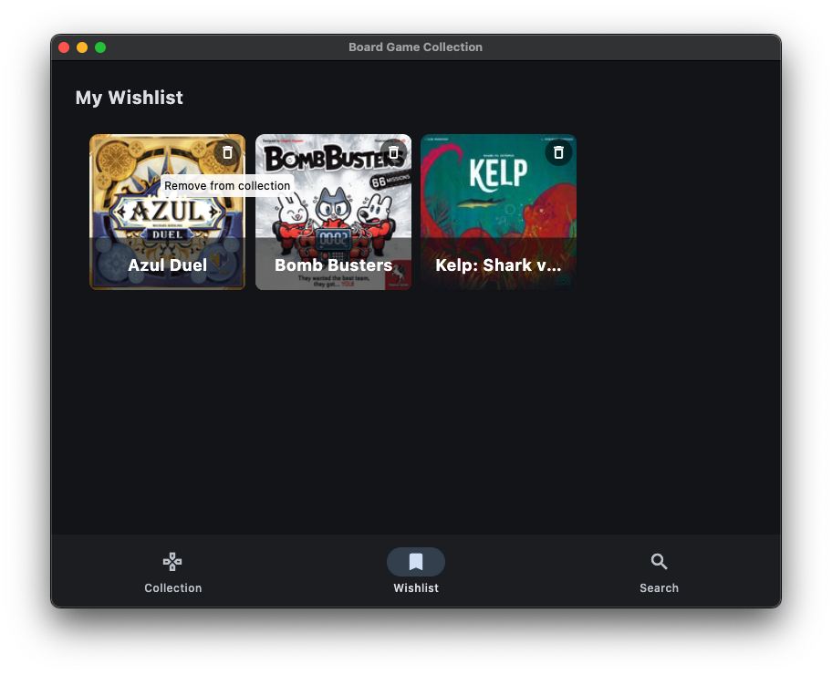

# Board Game collection

This python project is a small app where you can catalog your owned and wishlisted board games.

This project was created as part of the 2025 [boot.dev](https://boot.dev) Hackathon.

- [Requirements](#requirements)
- [Installation](#installation)
- [Usage](#usage)

## Requirements

The following is required to run this app:

- python (>= 3.12)
- [poetry](https://python-poetry.org/) package manager (can be isntalled via python)


## Installation

### Option 1: Using poetry

If you alread have poetry installed you can create a new venv using and install the dependencies in it.

Create virtual environment:

```sh
# replace 'python3.12' with your python executeable
poetry env use python3.12
```

Install dependencies:

```sh
poetry install
```

### Option 2: Create venv and install

If you don't have poetry installed you can set it up inside a python venv and use it to install the rest of the dependencies.

Create python virtual environment:

```sh
# replace 'python3.12' with your python executeable
python3.12 -m venv .venv
```

Activate the virtual environment:

```sh
# Windows
.venv\Scripts\activate
# Mac, Linux
source .venv/bin/activate
```

Install poetry and the rest of the dependencies:

```sh
pip install poetry
poetry install
```

## Run the application

You can run the application with flet:

```py
poetry run flet run
```

## Usage

> [!NOTE]
> This app uses a public API from Board Game Geek (https://boardgamegeek.com/wiki/page/BGG_XML_API). Please be considerate when using the app and try not to send too many requests too frequently.

### Search for board games

When you first run the app you will have empty collections. You can navigate to the search page and search for a board game. The results will be listed and you can add the entries to your owned games collection or your wishlist.



### Browse your collection

After you have added some board games to your collection(s) you can view them on the **Collection** and **Wishlist** pages.




### Check game details

Clicking on a board game tile will bring up some details about it.



### Remove games from your collection(s)

You can remove games for a given collection, by clicking the Bin icon in the upper-right corner.


